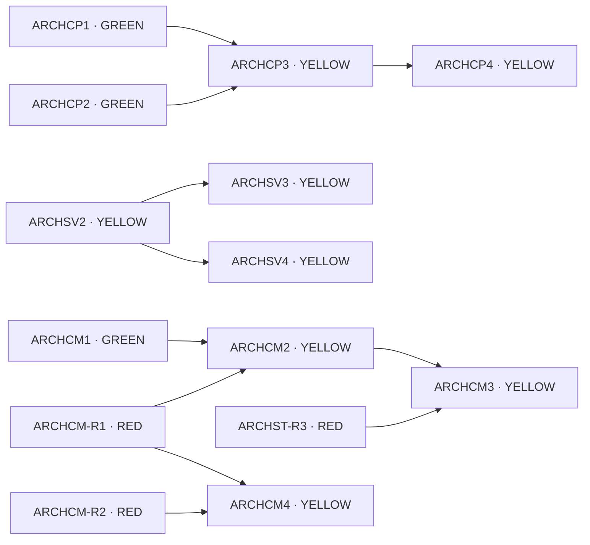

# Architecture Queue — Index (human map)

> **Source of truth = the item files** under `docs/ai/queue/items/*.md`. This page
> is only a navigable map; if it disagrees with an item file's frontmatter, the
> item file wins. Lifecycle/policy lives in
> [`docs/ai/AUTOPILOT_QUEUE.md`](../AUTOPILOT_QUEUE.md).

Generated by the Self-Feeding Architecture Epic (topology scan of
`internal/workspace_knowledge`, `internal/store`, `internal/server`,
`internal/drivers/copilot`, `cmd/scraper`, 2026-06-26).

**Lane key** — GREEN: package-internal pure / file-responsibility cleanup, no
import-boundary or DB/auth/ledger/connector/queue/runtime change. YELLOW:
behavior-preserving move-only that crosses an import boundary (sequential by
deps — in Go a folder move *is* an import-boundary change). RED: audit-only,
`status: BLOCKED`, human decision required — never auto-implemented.

## At a glance

- **Active item:** [ARCHWK1](items/ARCHWK1-governance-output-validation-split.md) — REVIEW (this PR).
- **Next executable (GREEN, no unmet deps):** [ARCHWK2](items/ARCHWK2-products-canonical-split.md),
  [ARCHWK3](items/ARCHWK3-retrieval-helpers-rename.md),
  [ARCHST1](items/ARCHST1-store-test-fallback-migration.md),
  [ARCHSV1](items/ARCHSV1-crawl-direct-post-helper-extract.md),
  [ARCHCP1](items/ARCHCP1-agent-brain-split.md),
  [ARCHCP2](items/ARCHCP2-agent-preflight-split.md),
  [ARCHCM1](items/ARCHCM1-action-args-split.md).
- **Executable YELLOW (no unmet deps):** [ARCHSV2](items/ARCHSV2-agent-finalize-subpackage.md),
  [ARCHWK4](items/ARCHWK4-soak-internal-grouping.md).
- **Blocked RED (audit-only):** ARCHST-R1, ARCHST-R2, ARCHST-R3, ARCHSV-R1, ARCHCM-R1, ARCHCM-R2.

## How to resume

Run **`/thg-next`** — it pulls latest `main`, runs `scripts/ai_preflight.sh`, reads
`docs/ai/AUTOPILOT_QUEUE.md` + the item files, and picks the first **executable
READY** item (all `depends_on` DONE). It will not pick a `BLOCKED` (RED) item.
GREEN sprint mode runs only `parallel_safe: true` items with no unmet deps. RED
items need `/thg-red-audit` and a human decision. One PR per item; never merge.

---

## internal/workspace_knowledge

### GREEN implementation
| Item | Status | Summary |
|---|---|---|
| [ARCHWK1](items/ARCHWK1-governance-output-validation-split.md) | REVIEW | Split governance Layer-3 validator into per-check files (banned/guarantee/shipping/pricing). |
| [ARCHWK2](items/ARCHWK2-products-canonical-split.md) | READY | Split `products/canonical.go` by responsibility (canonical / availability / pricing / normalize). |
| [ARCHWK3](items/ARCHWK3-retrieval-helpers-rename.md) | READY | Replace vague `retrieval/helpers.go` with responsibility files (tokenize / scoring / query). |

### YELLOW implementation
| Item | Status | Deps | Summary |
|---|---|---|---|
| [ARCHWK4](items/ARCHWK4-soak-internal-grouping.md) | READY | — | Decompose the 12-file `soak` package (sibling grouping vs subpackages). |

---

## internal/store

### GREEN implementation
| Item | Status | Summary |
|---|---|---|
| [ARCHST1](items/ARCHST1-store-test-fallback-migration.md) | READY | Move top-level cross-domain `*_test.go` fallbacks into owning subpackage external tests. |

### RED audit-only / blocked
| Item | Status | Summary |
|---|---|---|
| [ARCHST-R1](items/ARCHST-R1-append-only-ledger-audit.md) | BLOCKED | Audit append-only ledger UPDATE violations (action_ledger / engagement_reconcile). |
| [ARCHST-R2](items/ARCHST-R2-connector-lease-cas-audit.md) | BLOCKED | Audit connector pairing lease / CAS consistency vs reverify lease. |
| [ARCHST-R3](items/ARCHST-R3-direct-post-boundary-audit.md) | BLOCKED | Audit direct-post lookup boundary (leads ↔ coordination ownership). |

---

## internal/server

### GREEN implementation
| Item | Status | Summary |
|---|---|---|
| [ARCHSV1](items/ARCHSV1-crawl-direct-post-helper-extract.md) | READY | Extract pure crawl direct-post outcome-classification helpers. |

### YELLOW implementation
| Item | Status | Deps | Summary |
|---|---|---|---|
| [ARCHSV2](items/ARCHSV2-agent-finalize-subpackage.md) | READY | — | Extract `internal/server/agent/finalize` subpackage (move-only, CAS-adjacent). |
| [ARCHSV3](items/ARCHSV3-agent-crawl-ingest-subpackage.md) | READY | ARCHSV2 | Extract `internal/server/agent/crawl_ingest` subpackage. |
| [ARCHSV4](items/ARCHSV4-agent-outbox-subpackage.md) | READY | ARCHSV2 | Extract `internal/server/agent/outbox` subpackage (preserve dashboard JSON). |

### RED audit-only / blocked
| Item | Status | Summary |
|---|---|---|
| [ARCHSV-R1](items/ARCHSV-R1-workspace-orchestration-audit.md) | BLOCKED | Audit workspace browser-orchestration split (runtime state; auth-adjacent). |

---

## internal/drivers/copilot

### GREEN implementation
| Item | Status | Summary |
|---|---|---|
| [ARCHCP1](items/ARCHCP1-agent-brain-split.md) | READY | Split 525-line `agent_brain.go` into client / types / validator / action-prep siblings. |
| [ARCHCP2](items/ARCHCP2-agent-preflight-split.md) | READY | Split `agent_preflight.go` (account readiness vs business-context inference). |

### YELLOW implementation
| Item | Status | Deps | Summary |
|---|---|---|---|
| [ARCHCP3](items/ARCHCP3-intent-subpackage.md) | READY | ARCHCP1, ARCHCP2 | Extract `copilot/intent` subpackage (no cross-cluster cycle). |
| [ARCHCP4](items/ARCHCP4-agent-subpackage.md) | READY | ARCHCP3 | (Optional) extract `copilot/agent` subpackage — only if still tripping the file-count trigger. |

---

## cmd/scraper

### GREEN implementation
| Item | Status | Summary |
|---|---|---|
| [ARCHCM1](items/ARCHCM1-action-args-split.md) | READY | Split `action_args.go` (pure coercion vs domain-aware helpers). |

### YELLOW implementation
| Item | Status | Deps | Summary |
|---|---|---|---|
| [ARCHCM2](items/ARCHCM2-outbound-pipeline-move.md) | READY | ARCHCM1, ARCHCM-R1 | Move leaked outbound pipeline out of cmd into `internal/outbound`. |
| [ARCHCM3](items/ARCHCM3-direct-post-intake-move.md) | READY | ARCHCM2, ARCHST-R3 | Move direct-post intake service/scheduler into `internal/directpost`. |
| [ARCHCM4](items/ARCHCM4-crawl-runtime-move.md) | READY | ARCHCM-R1, ARCHCM-R2 | Move crawl runtime/plan/scheduler into `internal/crawler` + `internal/jobs`. |

### RED audit-only / blocked
| Item | Status | Summary |
|---|---|---|
| [ARCHCM-R1](items/ARCHCM-R1-account-scope-consolidation-audit.md) | BLOCKED | Audit + consolidate duplicated account-control RBAC (security). |
| [ARCHCM-R2](items/ARCHCM-R2-crawl-runtime-semantics-audit.md) | BLOCKED | Audit crawl runtime / connector dispatch / fallback semantics. |

---

## Dependency order (main chains only)

GREEN items with no `depends_on` are omitted — they are independently executable.
RED audits gate the cmd/scraper move-out chain.

